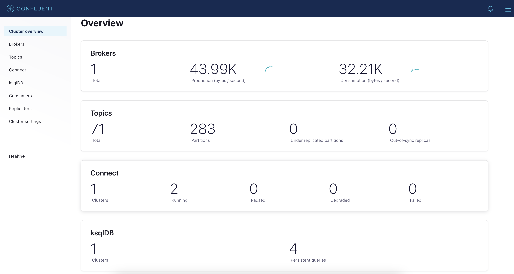
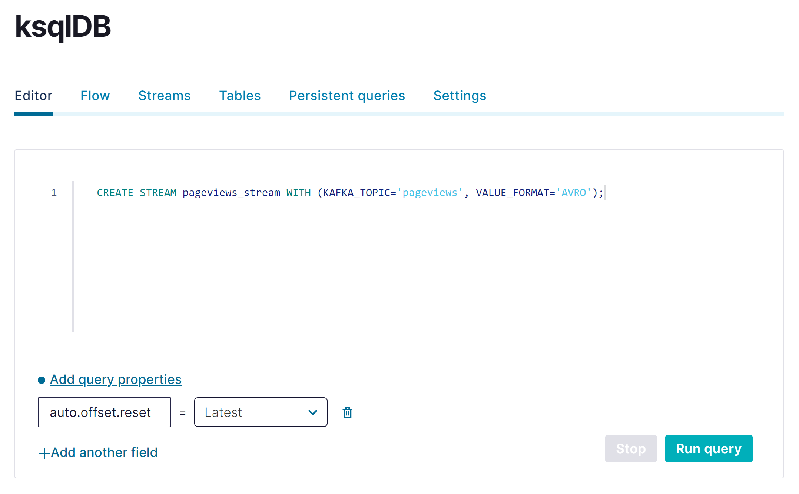
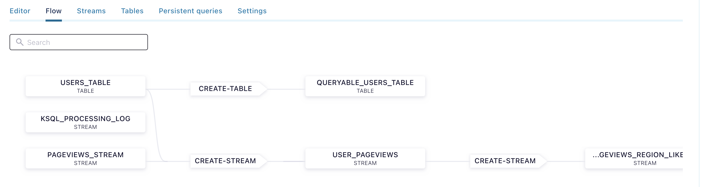

# BASIC

## Confluent Platform

Use Confluent Platform and a few SQL statements to build a real-time application that processes example data streams.

In this quick start, you will:

* **Install and run** Confluent Platform and Apache Kafka®.
* **Generate** real-time mock data.
* **Create topics** to store your data.
* **Create real-time streams** on your data.
* **Query and join streams** with SQL statements.
* **Build a view** that updates as new events arrive.
* **Visualize the topology** of your streaming app.

## Installation

### Prerequisites

The pre-requisites are:

* Windows, Mac or Linux
* Any Container Engine with docker compose support (Rancher Desktop, Docker for desktop, etc..).
* Install Curl, jq, etc..

### Download and Run

There is an [official Github Repo](https://github.com/confluentinc/cp-all-in-one) with some docker-compose files that can be used for developers or for demos purposes. The recommendation is to use the `cp-all-in-one` or `cp-all-in-one-comunity` ones, since they provide the main Confluent Platform functionality.

```bash
# Run following commands

# Download the docker-compose file with the desired Confluent version
curl --silent --output docker-compose.yml \
  https://raw.githubusercontent.com/confluentinc/cp-all-in-one/7.3.3-post/cp-all-in-one/docker-compose.yml

# Enterprise Version with Control Center
cd examples/01-Basic
docker compose -f docker-compose-enterprise.yml up

# Wait until Control Center start
curl --retry 10 -f --retry-all-errors --retry-delay 5 -s -o /dev/null "http://localhost:9021/"

# Check everything is Running (you need to specify the docker compose file)
docker compose -f docker-compose-enterprise.yml ps

# NAME                IMAGE                                             COMMAND                  SERVICE             CREATED             STATUS     
# broker              confluentinc/cp-server:7.3.2                      "/etc/confluent/dock…"   broker              4 minutes ago       Up 4 minutes
# connect             cnfldemos/cp-server-connect-datagen:0.6.0-7.3.0   "/etc/confluent/dock…"   connect             4 minutes ago       Up 4 minutes
# control-center      confluentinc/cp-enterprise-control-center:7.3.2   "/etc/confluent/dock…"   control-center      4 minutes ago       Up 4 minutes
# ksql-datagen        confluentinc/ksqldb-examples:7.3.2                "bash -c 'echo Waiti…"   ksql-datagen        4 minutes ago       Up 4 minutes
# ksqldb-cli          confluentinc/cp-ksqldb-cli:7.3.2                  "/bin/sh"                ksqldb-cli          4 minutes ago       Up 4 minutes
# ksqldb-server       confluentinc/cp-ksqldb-server:7.3.2               "/etc/confluent/dock…"   ksqldb-server       4 minutes ago       Up 4 minutes
# rest-proxy          confluentinc/cp-kafka-rest:7.3.2                  "/etc/confluent/dock…"   rest-proxy          4 minutes ago       Up 4 minutes
# schema-registry     confluentinc/cp-schema-registry:7.3.2             "/etc/confluent/dock…"   schema-registry     4 minutes ago       Up 4 minutes
# zookeeper           confluentinc/cp-zookeeper:7.3.2                   "/etc/confluent/dock…"   zookeeper           4 minutes ago       Up 4 minutes

# Try to restart any service that is not running after some minutes waiting.
docker compose restart control-center

# Uninstall and clean up
docker system prune -a --volumes --filter "label=io.confluent.docker"
```

Open Control Center at [http://localhost:9021/](http://localhost:9021/). Control Center provides the features for building and monitoring production data pipelines and event streaming applications. You should see the Control Center Home with `controlcenter.cluster` running. Verify there is one **Healthy clusters** and no **Unhealthy clusters**. After clicking into the cluster, in the `Overview` Panel, check there are: 1 broker, X topics, 1 Connect and 1 ksqlDB running.



## Demo

### 1. Create Topics

Create two topics by using **Confluent Control Center**. The topics are named `pageviews` and `users`. Later we create data generators that produce data to these topics. To create the topics, click into `controlcenter.cluster`, select **Topics** in the Navigation Menu and press **Add Topic**. Fill **Topic name**, **Number of partitions** and press **Create with defaults**. For each topics, you can see details such as **Overview**, **Messages**, **Schema** and **Configuration**.

You can also use CLI to create Topics.

```bash
# Create topics using CLI using following commands.

# Create "pageviews" topic
docker exec broker kafka-topics --create --if-not-exists --bootstrap-server localhost:9092 --partitions 1 --replication-factor 1 --topic pageviews
# Create "users" topic
docker exec broker kafka-topics --create --if-not-exists --bootstrap-server localhost:9092 --partitions 1 --replication-factor 1 --topic users
```

Additional Commands for Topics.

> Others tools, such as [AKHQ](https://github.com/tchiotludo/akhq) can be used to get almost the same information for Topics, Consumer groups, Metrics, etc..

```bash
#####################
# Topics Commands
#####################

# List all topics created
docker exec broker kafka-topics --list --exclude-internal --bootstrap-server localhost:9092

# See topic details
docker exec broker kafka-topics --describe --bootstrap-server localhost:9092 --topic users

# Delete topic
docker exec broker kafka-topics --delete --bootstrap-server localhost:9092 --topic users

# Alter the topic (Be aware there are configuration that are shared among topic/brokers or need to be restarted, see documentation)
docker exec broker kafka-topics --alter --bootstrap-server localhost:9092 --topic users --partitions 5

# List all topics created
docker exec broker kafka-topics --describe --under-replicated-partitions --bootstrap-server localhost:9092

# Check current-offset, log-end-offset, etc per consumer group, topic and partition
docker exec broker kafka-consumer-groups --bootstrap-server localhost:9092 --all-groups --describe
```

### 2. Generate Mock Data

In Kafka, you get events from an external source by using a `connector`, which enables streaming large volumes of data to and from your cluster. Confluent publishes many connectors for integrating with external systems, like `MongoDb` and `Elasticsearch`. These are also called `source` connectors, since data is collected from a source and published into topics.

In this section, you run the `Datagen Source Connector` to generate Mock data. The mock data is stored in the `pageviews` and `users` topics that you created previously. There is a hand full of predefined `quickstart` schemas for experimenting with the `kafka-connect-datagen` such as: `pageviews`, `users`, `orders`, `clickstream`, etc... Those can be seen in the [documentation](https://github.com/confluentinc/kafka-connect-datagen/tree/master/src/main/resources)

1. In the Navigation Menu, click **Connect**.
2. Click the `connect-default` cluster in the **Connect clusters** list. (This is the `connect` container created)
3. Click **Add connector** to start creating a connector.
4. Select the `DatagenConnector` tile.
5. Enter the following configuration values:

   * **Name**: `datagen-pageviews`
   * **Key converter class**: `org.apache.kafka.connect.storage.StringConverter`
   * **kafka.topic**: `pageviews`
   * **max.interval**: `100`
   * **quickstart**: `pageviews`

   * **Name**: `datagen-users`
   * **Key converter class**: `org.apache.kafka.connect.storage.StringConverter`
   * **kafka.topic**: `users`
   * **max.interval**: `100`
   * **quickstart**: `users`

6. For each connector, click **Next** to review the connector configuration.
7. When you’re satisfied with the settings, click **Launch**.

You can also use the REST API directly to create the connector using `curl` command.

```bash
# Create the same connector but using the Rest API

# Mock "pageviews" data
curl -X POST http://localhost:8083/connectors \
-H 'Content-Type: application/json' \
-d '{
  "name": "datagen-pageviews",
  "config": {
    "name": "datagen-pageviews",
    "connector.class": "io.confluent.kafka.connect.datagen.DatagenConnector",
    "key.converter": "org.apache.kafka.connect.storage.StringConverter",
    "kafka.topic": "pageviews",
    "max.interval": "100",
    "quickstart": "pageviews"
  }
}' \
| jq .

# Mock "users" data
curl -X POST http://localhost:8083/connectors \
-H 'Content-Type: application/json' \
-d '{
  "name": "datagen-users",
  "config": {
    "name": "datagen-users",
    "connector.class": "io.confluent.kafka.connect.datagen.DatagenConnector",
    "key.converter": "org.apache.kafka.connect.storage.StringConverter",
    "kafka.topic": "users",
    "max.interval": "100",
    "quickstart": "users"
  }
}' \
| jq .

# You can also use PUT, since is the idempotent way of updating a connector.
# It will create the connector if it doesn’t exist, or update it if it already exists

```

Whatever the method used you will see the following response of the source created `pageviews` or `users`.

```json
{
  "name": "datagen-pageviews",
  "config": {
    "name": "datagen-pageviews",
    "connector.class": "io.confluent.kafka.connect.datagen.DatagenConnector",
    "key.converter": "org.apache.kafka.connect.storage.StringConverter",
    "kafka.topic": "pageviews",
    "max.interval": "100",
    "quickstart": "pageviews"
  },
  "tasks": [],
  "type": "source"
}
```

Messages published to `pageviews` and `users` Topics, can be seen using the cli commands or using **Confluent Control Center** -> Topics -> `pageviews` -> Messages. You can also take a look into the **Schema** to check the current AVRO schema used to serialize the messages. Using `kafka-console-consumer` does not take into consideration AVRO deserializer, so it would be unknown characters.


Following is the AVRO Schema for `pageviews`

```json
{
  "connect.name": "ksql.pageviews",
  "fields": [
    {
      "name": "viewtime",
      "type": "long"
    },
    {
      "name": "userid",
      "type": "string"
    },
    {
      "name": "pageid",
      "type": "string"
    }
  ],
  "name": "pageviews",
  "namespace": "ksql",
  "type": "record"
}
```

Use the following commands to get the Messages using specialized cli for AVRO Schemas.

```bash
###############
# With Schema
###############

# Get the first 10 messages from the "pageviews" topic (With Schema)
docker exec schema-registry kafka-avro-console-consumer \
--bootstrap-server broker:29092 \
--topic pageviews \
--from-beginning \
--max-messages 10 \
--property schema.registry.url=http://localhost:8081

# {"viewtime":1,"userid":"User_9","pageid":"Page_67"}
# {"viewtime":11,"userid":"User_5","pageid":"Page_94"}
# {"viewtime":21,"userid":"User_1","pageid":"Page_10"}
# {"viewtime":31,"userid":"User_2","pageid":"Page_13"}
# {"viewtime":41,"userid":"User_2","pageid":"Page_22"}
# {"viewtime":51,"userid":"User_4","pageid":"Page_65"}
# {"viewtime":61,"userid":"User_5","pageid":"Page_60"}
# {"viewtime":71,"userid":"User_2","pageid":"Page_51"}
# {"viewtime":81,"userid":"User_1","pageid":"Page_84"}
# {"viewtime":91,"userid":"User_1","pageid":"Page_62"}

# Get the first 10 messages from the "users" topic (With Schema)
docker exec schema-registry kafka-avro-console-consumer \
--bootstrap-server broker:29092 \
--topic users \
--from-beginning \
--max-messages 10 \
--property schema.registry.url=http://localhost:8081

# {"registertime":1518814007506,"userid":"User_8","regionid":"Region_1","gender":"OTHER"}
# {"registertime":1517175226966,"userid":"User_1","regionid":"Region_5","gender":"FEMALE"}
# {"registertime":1501101974434,"userid":"User_2","regionid":"Region_9","gender":"FEMALE"}
# {"registertime":1494652715972,"userid":"User_6","regionid":"Region_1","gender":"FEMALE"}
# {"registertime":1500555322339,"userid":"User_5","regionid":"Region_6","gender":"MALE"}
# {"registertime":1508793017845,"userid":"User_9","regionid":"Region_1","gender":"OTHER"}
# {"registertime":1510734383921,"userid":"User_1","regionid":"Region_2","gender":"FEMALE"}
# {"registertime":1498943089015,"userid":"User_6","regionid":"Region_1","gender":"OTHER"}
# {"registertime":1515533495661,"userid":"User_6","regionid":"Region_4","gender":"OTHER"}
# {"registertime":1487914508571,"userid":"User_5","regionid":"Region_6","gender":"FEMALE"}

##################
# without Schema
##################

# Get the first 10 messages from the "pageviews" topic
docker exec broker kafka-console-consumer \
--bootstrap-server localhost:9092 \
--topic pageviews \
--from-beginning \
--max-messages 10 \
--property print.key=true \
--property key.separator=":"

#1:
#  User_9Page_67
#11:
#   User_5Page_94
#21:*
#    User_1Page_10
#31:>
#    User_2Page_13
#...
```

**KSQL** can also be used to see the messages from a Topic

```bash
# Run ksql within the "ksqldb-cli" container created
docker exec -it ksqldb-cli ksql http://ksqldb-server:8088 
```

Run following SQL statement

```sql
-- See all topics created
SHOW TOPICS;

-- See pageviews published by the connector
PRINT pageviews;
```

Other useful commands used for Kafka Connect.

```bash
#####################
# Connect API
#####################

# List basic information about the cluster
curl http://localhost:8083/ | jq .

# List installed plugins
curl -s localhost:8083/connector-plugins | jq .

# List of connectors instances
curl -s -X GET "http://localhost:8083/connectors/" | jq .

# Get the configuration of the connector
curl -X GET http://localhost:8083/connectors/datagen-pageviews/config \
-H  "Content-Type:application/json" \
| jq .

# Status of the Connector and Tasks
curl -s -X GET "http://localhost:8083/connectors/datagen-pageviews/status" | jq .

# Delete a connector
curl -s -X DELETE "http://localhost:8083/connectors/datagen-pageviews"

# You can also Restart, Pause and Resume a Connector.
```

### 3. Create Streams and Tables using SQL (KSQL)

The main differences between a **Stream** and **Table** are:

* A **Stream** is a an **Immutable**, append-only collection that represents a series of historical facts, or events. Once a row is inserted into a stream, the row can never change. You can append new rows at the end of the stream, but you can’t update or delete existing rows. In Kafka ecosystem a **stream** is additional functionality based on Topics, like a Wrapper. A Stream is **stateless**, since there is no state but a sequence of events. A **Stream** creates an underneath **topic** that can be consumed by a normal consumer.
* A **Table** is a **Mutable** collection that models change over time. It uses row keys to display the most recent data for each key. All but the newest rows for each key are deleted periodically. Also, each row has a timestamp, so you can define a windowed table which enables controlling how to group records that have the same key for stateful operations – like aggregations and joins – into time spans. Windows are tracked by record key. A Stream is **statefull**, since it stores the final state only.

The steps to execute SQL queries using **Confluent Control Center** are:

1. In the navigation menu, click ksqlDB.
2. Click the ksqlDB application to open the ksqlDB page. There are tabs for editing SQL statements and for monitoring the streams and tables that you create.
3. Execute the SQL statement. **Stream** and **Table** names are not `case-sensitive` so you cannot distinct names by the `letter-case` used.



You can use `ksql` to execute SQL queries using command line.

```bash
# Run ksql within the "ksqldb-cli" container created
docker exec -it ksqldb-cli ksql http://ksqldb-server:8088 

# Execute any SQL query...
```

The following steps show how use the `CREATE STREAM` and `CREATE TABLE` statements to register a stream on the `pageviews` topic and a table on the `users` topic. Registering a stream or a table on a topic **enables** SQL queries on the topic’s data.

Execute SQL statement that register a **stream**, named `pageviews_stream`, on the `pageviews` **topic**.

```sql
-- Run following statement to create the STREAM
CREATE STREAM pageviews_stream 
WITH (KAFKA_TOPIC='pageviews', VALUE_FORMAT='AVRO');

-- Message
----------------
-- Stream created
----------------
```

To query the data **stream** created use the SQL statement `SELECT`.

> You can use `EMIT CHANGES` at the end ot the statement to **indefinitely/continuous** see the streaming updates. This is also called **Push Query**.

```sql
-- Run following statement to query the Stream via Push
SELECT * FROM pageviews_stream EMIT CHANGES;

-- Run following statement to query the Stream via Pull
SELECT * FROM pageviews_stream;

-- Some operations are not allowed using Push or Pull methods, depending on the clauses used.
```

Execute SQL statement that register a **table**, named `users_table`, on the `users` **topic**.

> A **table** requires you to specify a `PRIMARY KEY` when you register it. In **ksqlDB**, a table is similar to tables in other SQL systems: a table has zero or more rows, and each row is **identified** by its `PRIMARY KEY`.

```sql
-- Run following statement to create the TABLE
CREATE TABLE users_table (id VARCHAR PRIMARY KEY)
WITH (KAFKA_TOPIC='users', VALUE_FORMAT='AVRO');

-- Message
----------------
-- Table created
----------------
```

To query the data **table** created use the SQL statement `SELECT`.

```sql
-- Run following statement to query the Table via Push
SELECT * FROM users_table EMIT CHANGES;

-- By default table are not queryable. To derive a queryable table use the following syntax
CREATE TABLE queryable_users_table AS SELECT * FROM users_table;

-- Message
------------------------------------------------------
-- Created query with ID CTAS_QUERYABLE_USERS_TABLE_5
------------------------------------------------------

-- Run following statement to query the Queryable table via Push
SELECT * FROM queryable_users_table;
SELECT * FROM queryable_users_table LIMIT 4;

-- KSQL does not allow ORDER BY. Following are the main clauses allowed
-- {';', 'EMIT', 'WHERE', 'WINDOW', 'GROUP', 'HAVING', 'LIMIT', 'PARTITION'}
```

Inspect the schemas of your **Stream** and **Table**. By default KSQL is able to **Create** and **Register** automatically Schemas for the Streams or Table create. The format (`String`, `JSON`, AVRO) can be configured during the creation. For the `Avro`, `JSON_SR`, and `Protobuf` formats, Schema Registry infers schemas automatically.

In **Cofluent Control Center**, click **Streams** to see the currently **streams** registered. In the list, click `PAGEVIEWS_STREAM` to see details about the stream In the **Schema** section, you can see the `field` names and `types` for the message values produced by the `datagen-pageviews` connector. 

### 4. Create "persistent" queries to Process Data

You can create different kinds of **SQL** queries in KS**QL

* **Transient query**: a `non-persistent`, `client-side` query that you terminate manually or with a LIMIT clause. **A transient query doesn’t create a new topic**.
* **Persistent query**: a `server-side` query that outputs/creates a **new stream or table** that’s backed by a new topic. It runs until you issue the `TERMINATE` statement. The syntax for a **persistent query** uses the `CREATE STREAM AS SELECT` or `CREATE TABLE AS SELECT` statements.
* **Push query**: A query that produces results **continuously** to a subscription. The syntax for a push query uses the `EMIT CHANGES` keyword. Push queries can be **transient** or **persistent**.
* **Pull query**: A query that gets a result as of “now”, like a query against a **traditional** relational database. A **pull** query runs once and returns the **current state** of a table. Tables are **updated incrementally** as new events arrive, so pull queries run with predictably low latency. P**ull queries are always transient**.

#### Query from Stream

You can perform transient queries from Streams.

```sql
-- Push and Transient Query continuously (terminate manually Ctrl+c or by clicking Terminate)
SELECT * FROM pageviews_stream EMIT CHANGES;

-- Push and Transient Query with a Limit clause (it terminates a soon it receives three elements)
SELECT pageid FROM pageviews_stream EMIT CHANGES LIMIT 3;

-- Pull and Transient Query with a Limit clause
SELECT * FROM pageviews_stream LIMIT 3;
```

#### Join Stream and Table

Create a new **Stream** `user_pageviews` by using a **persistent query** that **joins** `pageviews_stream` with `users_table` on the `userid` key. This join enriches `pageview` data with information about the `user` who viewed the page. The joined rows are written to a **new sink topic**, which has the same name as the new stream: *this means a stream is basically a Topic*.

> You can specify the name of the **sink** topic by using the `KAFKA_TOPIC` keyword in a `WITH` clause.

```sql
-- Create the new Stream Joining the Stream and Table.
CREATE STREAM user_pageviews
  AS SELECT users_table.id AS userid, pageid, regionid, gender
    FROM pageviews_stream
    LEFT JOIN users_table ON pageviews_stream.userid = users_table.id
EMIT CHANGES;

-- With KSQL is possible to join table-table, table-stream and stream-stream. 
-- With stream-stream it is needed to set a Windowed interval.

-- Message
-----------------------------------------------
-- Created query with ID CSAS_USER_PAGEVIEWS_7
-----------------------------------------------

-- It return the name of the "persistent query" with the prefix "CSAS_" that Stands for "CREATE STREAM AS SELECT"

-- Perform a Query to return an Stream of pageviewas joined with Users in realtime. 
-- Both pageviews and users are updates since those were previously created.
SELECT * FROM user_pageviews EMIT CHANGES;
```

#### Filter a Stream

Create a **Stream**, named `pageviews_region_like_89`, which is made of `user_pageviews` rows that have a `regionid` value that ends with `8` or `9`. Results from this query are written to a **new topic**, named `pageviews_filtered_r8_r9`. The topic name is specified explicitly in the query by using the `KAFKA_TOPIC` keyword.

```sql
-- Create a Stream but specifying the topic name and the serialization format
CREATE STREAM pageviews_region_like_89
  WITH (KAFKA_TOPIC='pageviews_filtered_r8_r9', VALUE_FORMAT='AVRO')
    AS SELECT * FROM user_pageviews
    WHERE regionid LIKE '%_8' OR regionid LIKE '%_9'
EMIT CHANGES;

-- Message
---------------------------------------------------------
-- Created query with ID CSAS_PAGEVIEWS_REGION_LIKE_89_9
---------------------------------------------------------

-- Perform a query from the Stream created
SELECT * FROM pageviews_region_like_89 EMIT CHANGES;
```

#### Create a Windowed View

Create a table named `pageviews_per_region_89` (stateful) that **counts** the number of pageviews from regions 8 and 9 in a tumbling window with a `SIZE` of 30 seconds. The query result is an **aggregation** that counts and groups rows, so the result is a **table**, instead of a stream, since it store the result.

```sql
-- Create the Windowed View wih JSON format
CREATE TABLE pageviews_per_region_89 WITH (KEY_FORMAT='JSON')
  AS SELECT userid, gender, regionid, COUNT(*) AS numusers
    FROM pageviews_region_like_89
    WINDOW TUMBLING (SIZE 30 SECOND)
    GROUP BY userid, gender, regionid
    HAVING COUNT(*) > 1
EMIT CHANGES;

-- Message
---------------------------------------------------------
-- Created query with ID CTAS_PAGEVIEWS_PER_REGION_89_11
---------------------------------------------------------

-- Perform the query
SELECT * FROM pageviews_per_region_89 EMIT CHANGES;

-- The NUMUSERS column shows the count of users who clicked within each 30-second window.
-- For each Window the counter will be restored to start for each window.
```

#### Snapshot a table by using a Pull Query

The current state of a table can be query using a **pull query**, which returns rows for a specific key at the time you issue the query. A pull query runs once and terminates.

```sql
-- Query pageviews_per_region_89 table for all rows that have `User_1` in 'Region_9'
SELECT * FROM pageviews_per_region_89
WHERE userid = 'User_1' AND gender='FEMALE' AND regionid='Region_9';
```

### 4.  Visualize Stream topology

Using **Confluent Control Center**, it can be seen an **end-to-end** view of the whole system by using **Flow** view.

1. Click **Flow** to open Flow view. Your app’s stream topology appears, showing stream, tables, and the statements you executed to create them.
2. Click `USER_PAGEVIEWS` to inspect the joined stream.
3. Click the other nodes in the graph to inspect the data flowing through your app.


