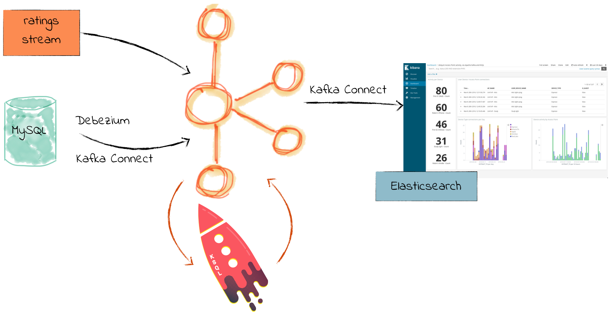
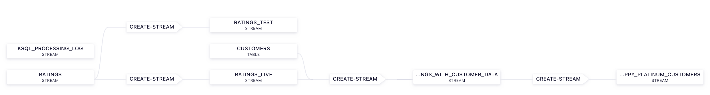
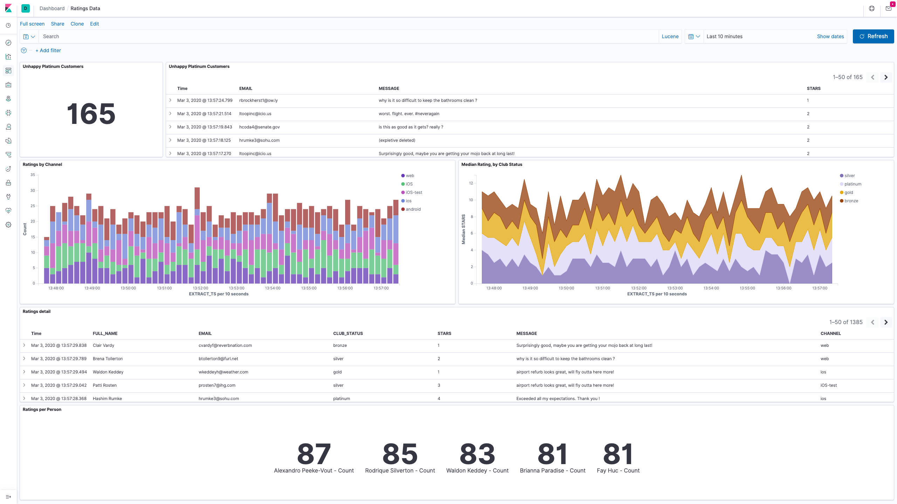

# INTEGRATIONS

## Installation

### Prerequisites

The pre-requisites are:

* Windows, Mac or Linux
* Any Container Engine with docker compose support (Rancher Desktop, Docker for desktop, etc..).
* Install Curl, jq, etc..

### Download and Run

There is an [official Github Repo](https://github.com/confluentinc/cp-all-in-one) with some docker-compose files that can be used for developers or for demos purposes. The recommendation is to use the `cp-all-in-one` or `cp-all-in-one-comunity` ones, since they provide the main Confluent Platform functionality.

```bash
# Run following commands

# Enterprise Version with Control Center
cd examples/02-Integrations
docker compose up

# Check everything is Running (you need to specify the docker compose file)
docker compose ps

# NAME                IMAGE                                             COMMAND                   SERVICE             CREATED             STATUS     
# broker              confluentinc/cp-server:7.3.2                      "/etc/confluent/dock…"    broker              3 minutes ago       Up 3 minutes
# connect             cnfldemos/cp-server-connect-datagen:0.6.0-7.3.0   "bash -c 'echo \"Inst…"   connect             3 minutes ago       Up 3 minutes
# control-center      confluentinc/cp-enterprise-control-center:7.3.2   "/etc/confluent/dock…"    control-center      3 minutes ago       Up 3 minutes
# elasticsearch       elasticsearch:8.7.0                               "/bin/tini -- /usr/l…"    elasticsearch       3 minutes ago       Up 3 minutes
# kibana              kibana:8.7.0                                      "/bin/tini -- bash -…"    kibana              3 minutes ago       Up 3 minutes
# ksql-datagen        confluentinc/ksqldb-examples:7.3.2                "bash -c 'echo Waiti…"    ksql-datagen        3 minutes ago       Up 3 minutes
# ksqldb-cli          confluentinc/cp-ksqldb-cli:7.3.2                  "/bin/sh"                 ksqldb-cli          3 minutes ago       Up 3 minutes
# ksqldb-server       confluentinc/cp-ksqldb-server:7.3.2               "/etc/confluent/dock…"    ksqldb-server       3 minutes ago       Up 3 minutes
# mysql               mysql:8.0                                         "docker-entrypoint.s…"    mysql               3 minutes ago       Up 3 minutes
# rest-proxy          confluentinc/cp-kafka-rest:7.3.2                  "/etc/confluent/dock…"    rest-proxy          3 minutes ago       Up 3 minutes
# schema-registry     confluentinc/cp-schema-registry:7.3.2             "/etc/confluent/dock…"    schema-registry     3 minutes ago       Up 3 minutes
# zookeeper           confluentinc/cp-zookeeper:7.3.2                   "/etc/confluent/dock…"    zookeeper           3 minutes ago       Up 3 minutes

# Try to restart any service that is not running after some minutes waiting.
docker compose restart control-center

# To watch the log for a particular service
docker compose logs connect -f

# Uninstall and clean up
docker system prune -a --volumes --filter "label=io.confluent.docker"
```

### Verification

Open Control Center at [http://localhost:9021/](http://localhost:9021/). Control Center provides the features for building and monitoring production data pipelines and event streaming applications. You should see the Control Center Home with `controlcenter.cluster` running. Verify there is one **Healthy clusters** and no **Unhealthy clusters**. After clicking into the cluster, in the `Overview` Panel, check there are: 1 broker, X topics, 1 Connect and 1 ksqlDB running.

```bash
# Wait until Confluent Control Center start
curl --retry 10 -f --retry-all-errors --retry-delay 5 -s -o /dev/null "http://localhost:9021/"
```

Check the **plugins** installed on Kafka Connect instance `connect`.

> It can bee seen it *Confluent Control Center* at Home -> `controlcenter.cluster` -> Connect clusters -> `connect-default` -> Connectors -> Add Connector.

```bash
# List basic information about the cluster
curl http://localhost:8083/ | jq .

# List installed plugins
curl -s localhost:8083/connector-plugins | jq .

# Filtering The desired plugins installed
curl -s localhost:8083/connector-plugins \
| jq '.[].class'\
| egrep 'DatagenConnector|MySqlConnector|ElasticsearchSinkConnector'
```

You should see the connectors installed for this demo: `ElasticsearchSinkConnector`, `DatagenConnector` and `MySqlConnector`.

```json
[
  {
    "class": "io.confluent.connect.elasticsearch.ElasticsearchSinkConnector",
    "type": "sink",
    "version": "14.0.6"
  },
  {
    "class": "io.confluent.kafka.connect.datagen.DatagenConnector",
    "type": "source",
    "version": "null"
  },
  {
    "class": "io.debezium.connector.mysql.MySqlConnector",
    "type": "source",
    "version": "2.1.4.Final"
  },
  {
    "class": "org.apache.kafka.connect.mirror.MirrorCheckpointConnector",
    "type": "source",
    "version": "7.3.0-ce"
  },
  {
    "class": "org.apache.kafka.connect.mirror.MirrorHeartbeatConnector",
    "type": "source",
    "version": "7.3.0-ce"
  },
  {
    "class": "org.apache.kafka.connect.mirror.MirrorSourceConnector",
    "type": "source",
    "version": "7.3.0-ce"
  }
]
```

Verify **MySQL** has been initialized.

```bash
# Veriy MySQL data has been creatd
docker exec -it mysql bash -c 'mysql -u $MYSQL_USER -p$MYSQL_PASSWORD demo'

# Get all customers
mysql> SELECT * FROM CUSTOMERS;
mysql> exit;
```

Verify **ElasticSearch** has been initialized and `kafkaconnect` index has been created.

```bash
# Verifiy kafkaconnect index has bee created
curl -s "http://localhost:9200/_index_template/kafkaconnect/" \
-H 'Content-Type: application/json' \
| jq .
```

It should return the following data.

```json
{
  "index_templates": [
    {
      "name": "kafkaconnect",
      "index_template": {
        "index_patterns": [
          "ratings*"
        ],
        "template": {
          "settings": {
            "index": {
              "number_of_shards": "1",
              "number_of_replicas": "0"
            }
          },
          "mappings": {
            "dynamic_templates": [
              {
                "dates": {
                  "mapping": {
                    "type": "date"
                  },
                  "match": "*_TS"
                }
              }
            ]
          }
        },
        "composed_of": []
      }
    }
  ]
}
```

Verify **Kibana** is working at [http://localhost:5601](http://localhost:5601)
You should see the [Index Template](http://localhost:5601/app/management/data/index_management/templates) created automatically during the initialization for `kafkaconnect` with the index for `ratings*`.

## Demo



### 1. Generate Mock Data

#### Ratings

First we create the `ratings` source data using `DatagenConnector` provided by Confluent. In this case we will be using the **Kafka Connect Rest API** or the **Confluent Control Center**

> We will use `PUT` since it's since is the **idempotent** way of updating a connector.

```bash
# Creating Data Generator for ratings using REST API (PUT Method)
curl -X PUT http://localhost:8083/connectors/datagen-ratings/config \
-H 'Content-Type: application/json' \
-d '{
    "connector.class": "io.confluent.kafka.connect.datagen.DatagenConnector",
    "key.converter": "org.apache.kafka.connect.storage.StringConverter",
    "kafka.topic": "ratings",
    "max.interval":750,
    "quickstart": "ratings",
    "tasks.max": 1
}' \
| jq .
```

Since it's the first time the connector will be created. The result will be the following json content.

```json
{
  "name": "datagen-ratings",
  "config": {
    "connector.class": "io.confluent.kafka.connect.datagen.DatagenConnector",
    "key.converter": "org.apache.kafka.connect.storage.StringConverter",
    "kafka.topic": "ratings",
    "max.interval": "750",
    "quickstart": "ratings",
    "tasks.max": "1",
    "name": "datagen-ratings"
  },
  "tasks": [],
  "type": "source"
}
```

Connectors can also be created using **KSQL**.

```bash
# Run ksql within the "ksqldb-cli" container created
docker exec -it ksqldb-cli ksql http://ksqldb-server:8088 
```

```sql
-- Create datagen-ratings connector
CREATE SINK CONNECTOR DATAGEN_RATINGS WITH (
    'connector.class' = 'io.confluent.kafka.connect.datagen.DatagenConnector',
    'key.converter'   = 'org.apache.kafka.connect.storage.StringConverter',
    'kafka.topic'     = 'ratings',
    'max.interval'    = 750,
    'quickstart'      = 'ratings',
    'tasks.max'       = 1
);

-- Message
-------------------------------------
-- Created connector DATAGEN_RATINGS
```

To see the data that is being generated use the following command or use **Confluent Control Center** instead.

```bash
# Get the first 10 messages from the "users" topic (With Schema)
docker exec schema-registry kafka-avro-console-consumer \
--bootstrap-server broker:29092 \
--topic ratings \
--from-beginning \
--max-messages 10 \
--property schema.registry.url=http://localhost:8081

# {"rating_id":1,"user_id":17,"stars":1,"route_id":1646,"rating_time":1,"channel":"iOS-test","message":"is this as good as it gets? really ?"}
# {"rating_id":2,"user_id":3,"stars":1,"route_id":9714,"rating_time":13,"channel":"ios","message":"(expletive deleted)"}
# {"rating_id":3,"user_id":7,"stars":3,"route_id":3859,"rating_time":25,"channel":"ios","message":"meh"}
# {"rating_id":4,"user_id":18,"stars":1,"route_id":1471,"rating_time":37,"channel":"iOS","message":"Exceeded all my expectations. Thank you !"}
# {"rating_id":5,"user_id":-1,"stars":4,"route_id":2263,"rating_time":49,"channel":"iOS","message":"why is it so difficult to keep the bathrooms clean ?"}
# {"rating_id":6,"user_id":10,"stars":2,"route_id":5274,"rating_time":61,"channel":"iOS","message":"your team here rocks!"}
# {"rating_id":7,"user_id":13,"stars":3,"route_id":1813,"rating_time":73,"channel":"android","message":"your team here rocks!"}
# {"rating_id":8,"user_id":-1,"stars":2,"route_id":2933,"rating_time":85,"channel":"web","message":"airport refurb looks great, will fly outta here more!"}
# {"rating_id":9,"user_id":11,"stars":1,"route_id":5373,"rating_time":97,"channel":"ios","message":"why is it so difficult to keep the bathrooms clean ?"}
# {"rating_id":10,"user_id":14,"stars":2,"route_id":2096,"rating_time":109,"channel":"iOS","message":"worst. flight. ever. #neveragain"}
```

**KSQL** can also be used to see the messages from a Topic

```bash
# Run ksql within the "ksqldb-cli" container created
docker exec -it ksqldb-cli ksql http://ksqldb-server:8088 
```

Run following SQL statement

```sql
-- See all topics created
SHOW TOPICS;

-- See ratings published by the connector
PRINT ratings;
```

Then we create the `ratings` sink connector using `ElasticsearchSinkConnector`. In this case we will be using **KSQL** to create the connector instead using REST API or **Confluent Control Center**, since connector can be created using SQL Statements.

```bash
# Run ksql within the "ksqldb-cli" container created
docker exec -it ksqldb-cli ksql http://ksqldb-server:8088 
```

Run following SQL Statement to create the Sink Connector for ratings.

```sql
-- Create the KINK Conectector
CREATE SINK CONNECTOR SINK_ES_RATINGS WITH (
    'connector.class' = 'io.confluent.connect.elasticsearch.ElasticsearchSinkConnector',
    'topics'          = 'ratings',
    'connection.url'  = 'http://elasticsearch:9200',
    'type.name'       = '_doc',
    'key.ignore'      = 'false',
    'schema.ignore'   = 'true',
    'transforms'= 'ExtractTimestamp',
    'transforms.ExtractTimestamp.type'= 'org.apache.kafka.connect.transforms.InsertField$Value',
    'transforms.ExtractTimestamp.timestamp.field' = 'RATING_TS'
);

-- Message
-------------------------------------
-- Created connector SINK_ES_RATINGS
-------------------------------------
```

After this operation **ElasticSearch** will create automatically [rating index](http://localhost:5601/app/management/data/index_management/indices).
Check **Kibana** is currently receiving data from `ratings` . Go to Kibana and Analytics -> [Discover](http://localhost:5601/app/discover#/).

### 2. Filtering the Streams

Inspect the topics created using SQL statement.

```sql
-- Show all topics created
SHOW TOPICS;

-- Kafka Topic                 | Partitions | Partition Replicas
-----------------------------------------------------------------
-- default_ksql_processing_log | 1          | 1
-- docker-connect-configs      | 1          | 1
-- docker-connect-offsets      | 25         | 1
-- docker-connect-status       | 5          | 1
-- ratings                     | 1          | 1
-----------------------------------------------------------------
```

Create a **Stream** derived from the `ratings` Topic

> The name of the **Stream** and the **Topic** could be the same. 

```sql
-- Create the "ratings" stream with automatic AVRO Schema from the Topic
CREATE STREAM RATINGS 
WITH (KAFKA_TOPIC='ratings',VALUE_FORMAT='AVRO');

-- Message
------------------
-- Stream created
------------------
```

Perform `client-side` (transient) queries using `push` to filter live stream of data of `ratings`.

```sql
-- Get all Messages via "push" and "transient"
SELECT * FROM RATINGS 
EMIT CHANGES;

-- Select specific columns
SELECT USER_ID, STARS, CHANNEL, MESSAGE FROM RATINGS 
EMIT CHANGES;

-- Perform  a Filter live stream of data
SELECT USER_ID, STARS, CHANNEL, MESSAGE FROM RATINGS 
WHERE LCASE(CHANNEL) NOT LIKE '%test%' 
EMIT CHANGES;
```

Create a `server-side` (permanent) derived stream that filter messages by `Channel`. In this case the new **Stream** will create a **Topic** that stores the new messages. The statement `CREATE STREAM AS SELECT` (`CSAS_**`) creates a new stream so it can filter data, enrich data, remove columns, etc..

> **Streams** create an underneath **Topic** that can be consumed by a normal **consumer**.

```sql
-- Create a new Stream `RATINGS_LIVE` that filter non test data. 
CREATE STREAM RATINGS_LIVE AS
SELECT * FROM RATINGS 
WHERE LCASE(CHANNEL) NOT LIKE '%test%'
EMIT CHANGES;

-- Create a new Stream `RATINGS_LIVE` that filter test data
CREATE STREAM RATINGS_TEST AS
SELECT * FROM RATINGS 
WHERE LCASE(CHANNEL) LIKE '%test%' 
EMIT CHANGES;

-- Query the first 5 items
SELECT * FROM RATINGS_LIVE 
EMIT CHANGES 
LIMIT 5;

-- Query the first 5 items
SELECT * FROM RATINGS_TEST 
EMIT CHANGES 
LIMIT 5;

-- Since these querys are base on Streams, it depends on the live data that flows from it.
-- It can take a while the 5 messages to be shown.

-- Shows the Schema/Columns of the Stream
DESCRIBE RATINGS_LIVE;

-- Describe an Stream (Schema, Partitions, Topic, Offsets, Consumer Groups, Statistics, etc..)
DESCRIBE RATINGS_LIVE EXTENDED;
```

### 3. Event Stream Database (Outbox Pattern)

In this section we are going to create a new connect source from a Database.

Get the data stored in `customers` database

```bash
# Veriy MySQL data has been creatd
docker exec -it mysql bash -c 'mysql -u $MYSQL_USER -p$MYSQL_PASSWORD demo'
```

Use SQL Statements to perform queries to the database.

> You will notice the similarities using **Standard SQL** and **KSQL**

```sql
-- Get database
SHOW TABLES;

--+----------------+
--| Tables_in_demo |
--+----------------+
--| CUSTOMERS      |
--+----------------+
--1 row in set (0.00 sec)

-- Perform a query by selecting specific columns
SELECT ID, FIRST_NAME, LAST_NAME, EMAIL, CLUB_STATUS FROM CUSTOMERS LIMIT 5;

--+----+-------------+------------+------------------------+-------------+
--| ID | FIRST_NAME  | LAST_NAME  | EMAIL                  | CLUB_STATUS |
--+----+-------------+------------+------------------------+-------------+
--|  1 | Rica        | Blaisdell  | rblaisdell0@rambler.ru | bronze      |
--|  2 | Ruthie      | Brockherst | rbrockherst1@ow.ly     | platinum    |
--|  3 | Mariejeanne | Cocci      | mcocci2@techcrunch.com | bronze      |
--|  4 | Hashim      | Rumke      | hrumke3@sohu.com       | platinum    |
--|  5 | Hansiain    | Coda       | hcoda4@senate.gov      | platinum    |
--+----+-------------+------------+------------------------+-------------+
--5 rows in set (0.00 sec)

-- Exit
exit;
```

Create new **source** connector using `MySqlConnector`. In this case all changes detected on `customers` table will be published into a Topic using **CDC** (**Change Data Capture**) and the `debezium` connector.

```sql
-- Create Source for Customers data (Be careful using " instead ', since it's SQL statements and quotes are specific)
CREATE SOURCE CONNECTOR SOURCE_DB_CUSTOMERS WITH (
    'connector.class'             = 'io.debezium.connector.mysql.MySqlConnector',
    'tasks.max'                   = '1',
    'database.hostname'           = 'mysql',
    'database.port'               = '3306',
    'database.user'               = 'debezium',
    'database.password'           = 'dbz',
    'database.server.id'          = '42',
    'topic.prefix'                ='mysql',
    'table.include.list'          = 'demo.customers', 
    'include.schema.changes'      = 'false',
    'transforms'                  = 'unwrap,extractkey',
    'transforms.unwrap.type'      = 'io.debezium.transforms.ExtractNewRecordState',
    'transforms.extractkey.type'  = 'org.apache.kafka.connect.transforms.ExtractField$Key',
    'transforms.extractkey.field' = 'id',
    'key.converter'               = 'org.apache.kafka.connect.storage.StringConverter',
    'value.converter'             = 'io.confluent.connect.avro.AvroConverter',
    'schema.history.internal.kafka.bootstrap.servers' = 'broker:29092',
    'schema.history.internal.kafka.topic'             = 'dbhistory.demo' ,
    'value.converter.schema.registry.url'             = 'http://schema-registry:8081'
    );

-- Message
------------------------------------------
--  Created connector SOURCE_DB_CUSTOMERS
------------------------------------------

-- Show the Connectors (instead using Rest API)
SHOW CONNECTORS;

-- Show Topics Created
SHOW TOPICS;

-- SHOW messages (Use quotes since the name is composed with escape characters)
PRINT 'mysql.demo.CUSTOMERS' FROM BEGINNING;

-- Delete connector
DROP CONNECTOR SOURCE_DB_CUSTOMERS;
```

Create Table from `Customer` data source

```sql
-- Create `CUSTOMERS` table from 'mysql.demo.CUSTOMERS' source
CREATE TABLE CUSTOMERS (CUSTOMER_ID VARCHAR PRIMARY KEY)
WITH (KAFKA_TOPIC='mysql.demo.CUSTOMERS', VALUE_FORMAT='AVRO');

-- Message
-----------------
-- Table created
-----------------

-- Query `CUSTOMERS` table (set the offset from the beginning of the stream)
SET 'auto.offset.reset' = 'earliest';
SELECT CUSTOMER_ID, FIRST_NAME, LAST_NAME, EMAIL, CLUB_STATUS FROM CUSTOMERS 
EMIT CHANGES
LIMIT 5;
```

Compare the replication between MySQL and Kaflka (KsqlDB).

```sql
----------
-- KsqlDB
----------

-- Run KsqlDB CLI
-- docker exec -it ksqldb-cli ksql http://ksqldb-server:8088 

-- Run following query to get the table changes in realtime
SET 'auto.offset.reset' = 'earliest';
SELECT CUSTOMER_ID, FIRST_NAME, LAST_NAME, EMAIL, CLUB_STATUS FROM CUSTOMERS 
EMIT CHANGES;

----------
-- MySQL
----------

-- Tun MYSQL CLI
-- docker exec -it mysql bash -c 'mysql -u $MYSQL_USER -p$MYSQL_PASSWORD demo'

INSERT INTO CUSTOMERS (ID,FIRST_NAME,LAST_NAME) VALUES (42,'Rick','Astley');
UPDATE CUSTOMERS SET EMAIL = 'rick@example.com' WHERE ID=42;
UPDATE CUSTOMERS SET CLUB_STATUS = 'bronze' WHERE ID=42;
UPDATE CUSTOMERS SET CLUB_STATUS = 'platinum' WHERE ID=42;

-- The idea is to execute statements in MySQL to been replicated into KsqlDB.
-- New lines are going to be print on the KsqlDB side with the changes.
```

Demonstrate difference between **Stream** and **Table**.

```sql
------------------------
-- SELECT FROM TABLE
------------------------

-- Create Query from Table
SELECT TIMESTAMPTOSTRING(ROWTIME, 'HH:mm:ss') AS EVENT_TS,
       CUSTOMER_ID,
       FIRST_NAME,
       LAST_NAME,
       EMAIL,
       CLUB_STATUS
  FROM CUSTOMERS WHERE ID=42
  EMIT CHANGES;

-- Previous Query will "return" the changelog because the "EMIT CHANGES".

-- "when you use EMIT CHANGE clause, you do not query a table "snapshot", but you get 
-- the "changelog" stream of the table from its initial empty state up to now (you issue 
-- a so-called push query). The result of your query is a stream of updated to the table.

-- Create a queryable table from the changelog to get the Snapshot.
CREATE TABLE QUERYABLE_CUSTOMERS AS SELECT * FROM CUSTOMERS;
SELECT TIMESTAMPTOSTRING(ROWTIME, 'HH:mm:ss') AS EVENT_TS,
       CUSTOMER_ID,
       FIRST_NAME,
       LAST_NAME,
       EMAIL,
       CLUB_STATUS
  FROM QUERYABLE_CUSTOMERS WHERE ID=42;

------------------------
-- SELECT FROM STREAMS
------------------------

-- Create stream
CREATE STREAM CUSTOMERS_STREAM (CUSTOMER_ID VARCHAR KEY) 
WITH (KAFKA_TOPIC='mysql.demo.CUSTOMERS', VALUE_FORMAT='AVRO');

-- Query the Stream
SET 'auto.offset.reset' = 'earliest';
SELECT TIMESTAMPTOSTRING(ROWTIME, 'HH:mm:ss') AS EVENT_TS,
       CUSTOMER_ID,
       FIRST_NAME,
       LAST_NAME,
       EMAIL,
       CLUB_STATUS
  FROM CUSTOMERS_STREAM WHERE ID=42
  EMIT CHANGES;
```

### 4. Joining streams

Create a SELECT statement to Join live-stream of `ratings` and `customer` data.

```sql
-- Query to Join the ratings and customer by rating.USER_ID and customer.CUSTOMER_ID
SELECT R.RATING_ID, R.MESSAGE, R.CHANNEL,
       C.CUSTOMER_ID, C.FIRST_NAME + ' ' + C.LAST_NAME AS FULL_NAME,
       C.CLUB_STATUS
FROM   RATINGS_LIVE R
       LEFT JOIN CUSTOMERS C
         ON CAST(R.USER_ID AS STRING) = C.CUSTOMER_ID
WHERE  C.FIRST_NAME IS NOT NULL
EMIT CHANGES;
```

Persist the query into a **Stream**. Previous SQL statement is going to be used but instead being transient, it will be persisted at server-side by using `CREATE STREAM AS SELECT`.

> It's **important** to reset the offset to `earliest`, so the new Stream can get old messages. If the offset is not reset, only newest messages are going to be added to the new Stream.

```sql
-- Join "Ratings" Stream and "Customers" table into "RATINGS_WITH_CUSTOMER_DATA" Stream and "ratings-enriched" Topic
SET 'auto.offset.reset' = 'earliest';
CREATE STREAM RATINGS_WITH_CUSTOMER_DATA
       WITH (KAFKA_TOPIC='ratings-enriched')
       AS
SELECT R.RATING_ID, R.MESSAGE, R.STARS, R.CHANNEL,
       C.CUSTOMER_ID, C.FIRST_NAME + ' ' + C.LAST_NAME AS FULL_NAME,
       C.CLUB_STATUS, C.EMAIL
FROM   RATINGS_LIVE R
       LEFT JOIN CUSTOMERS C
         ON CAST(R.USER_ID AS STRING) = C.CUSTOMER_ID
WHERE  C.FIRST_NAME IS NOT NULL
EMIT CHANGES;

-- Show Streams
SHOW STREAMS;

-- Show Topics 
SHOW TOPICS;

-- 
PRINT "ratings-enriched";
```

Examine changing reference data.

CUSTOMERS is a ksqlDB table, which means that we have the latest value for a given key.

```sql
----------
-- KsqlDB
----------

-- Select only the customer with ID=2
SELECT TIMESTAMPTOSTRING(ROWTIME, 'HH:mm:ss') AS EVENT_TS,
        FULL_NAME, CLUB_STATUS, STARS, MESSAGE, CHANNEL
  FROM RATINGS_WITH_CUSTOMER_DATA
  WHERE CAST(CUSTOMER_ID AS INT)=2
  EMIT CHANGES;

----------
-- MySQL
----------

-- Change the CLUB_STATUS to ID 2
UPDATE CUSTOMERS SET CLUB_STATUS = 'bronze' WHERE ID=2;

-- Observe in the continuous ksqlDB query that the customer name has now changed.
```

Create stream of unhappy VIPs

```sql
-- Create stream of unhappy VIPs
CREATE STREAM UNHAPPY_PLATINUM_CUSTOMERS AS
SELECT FULL_NAME, CLUB_STATUS, EMAIL, STARS, MESSAGE
FROM   RATINGS_WITH_CUSTOMER_DATA
WHERE  STARS < 3
  AND  CLUB_STATUS = 'platinum'
PARTITION BY FULL_NAME;

-- Message
------------------------------------------------------------
-- Created query with ID CSAS_UNHAPPY_PLATINUM_CUSTOMERS_13
------------------------------------------------------------

PRINT UNHAPPY_PLATINUM_CUSTOMERS;
```

Following is the current **flow** that has been generated using **Confluent Control Center**.



### 5. Stream to Elasticsearch

Create a Connector from `ratings-enriched` and `UNHAPPY_PLATINUM_CUSTOMERS` topics to sink to **ElasticSearch**.

```sql
-- Check both topics are already created
SHOW TOPICS;

-- Create the connector to sink Topics into ElasticSearch
CREATE SINK CONNECTOR SINK_ES_CUSTOMERS WITH (
  'connector.class' = 'io.confluent.connect.elasticsearch.ElasticsearchSinkConnector',
  'connection.url' = 'http://elasticsearch:9200',
  'type.name' = '',
  'behavior.on.malformed.documents' = 'warn',
  'errors.tolerance' = 'all',
  'errors.log.enable' = 'true',
  'errors.log.include.messages' = 'true',
  'topics' = 'ratings-enriched,UNHAPPY_PLATINUM_CUSTOMERS',
  'key.ignore' = 'true',
  'schema.ignore' = 'true',
  'key.converter' = 'org.apache.kafka.connect.storage.StringConverter',
  'transforms'= 'ExtractTimestamp',
  'transforms.ExtractTimestamp.type'= 'org.apache.kafka.connect.transforms.InsertField$Value',
  'transforms.ExtractTimestamp.timestamp.field' = 'EXTRACT_TS'
);

-- Message
---------------------------------------
-- Created connector SINK_ES_CUSTOMERS
---------------------------------------

-- Get the connectors created
SHOW CONNECTORS;

-- Connector Name      | Type   | Class                                                         | Status
------------------------------------------------------------------------------------------------------------------------------
-- SOURCE_DB_CUSTOMERS | SOURCE | io.debezium.connector.mysql.MySqlConnector                    | RUNNING (1/1 tasks RUNNING)
-- SINK_ES_CUSTOMERS   | SINK   | io.confluent.connect.elasticsearch.ElasticsearchSinkConnector | RUNNING (1/1 tasks RUNNING)
-- datagen-ratings     | SOURCE | io.confluent.kafka.connect.datagen.DatagenConnector           | RUNNING (1/1 tasks RUNNING)
------------------------------------------------------------------------------------------------------------------------------
```

Once the data is being published to Kibana, check [Kibana dashboard](http://localhost:5601/app/kibana#/dashboard/mysql-ksql-kafka-es)



Checkout the data directly in **Elasticsearch**.

```bash
# Run following command to get all indexed info
curl -s "http://localhost:9200/_cat/indices/*?h=idx,docsCount"

# unhappy_platinum_customers  249
# ratings-enriched           2267

# Execute queries directly onto ElasticSearch
curl 'http://localhost:9200/ratings-enriched/_search?q=*' | jq .
curl 'http://localhost:9200/unhappy_platinum_customers/_search?q=*' | jq .

# Get Pagination
curl 'http://localhost:9200/unhappy_platinum_customers/_search' \
-H 'Content-Type: application/json' \
-d'{
  "from": 0,
  "size": 400
}' \
| jq .

```

### 6. Aggregations and Other

```sql
-- Simple aggregation - count of ratings per person, per 15 minutes:
CREATE TABLE RATINGS_PER_CUSTOMER_PER_15MINUTE AS
SELECT FULL_NAME,COUNT(*) AS RATINGS_COUNT, COLLECT_LIST(STARS) AS RATINGS
  FROM RATINGS_WITH_CUSTOMER_DATA
        WINDOW TUMBLING (SIZE 15 MINUTE)
  GROUP BY FULL_NAME
  EMIT CHANGES;

-- Query data
  SELECT * FROM RATINGS_PER_CUSTOMER_PER_15MINUTE
  EMIT CHANGES;

-- Push Query
SELECT TIMESTAMPTOSTRING(WINDOWSTART, 'yyyy-MM-dd HH:mm:ss') AS WINDOW_START_TS,
       FULL_NAME,
       RATINGS_COUNT,
       RATINGS
  FROM RATINGS_PER_CUSTOMER_PER_15MINUTE
  WHERE FULL_NAME='Rica Blaisdell'
  EMIT CHANGES;

-- Pull Query
SELECT TIMESTAMPTOSTRING(WINDOWSTART, 'yyyy-MM-dd HH:mm:ss') AS WINDOW_START_TS,
       FULL_NAME,
       RATINGS_COUNT,
       RATINGS
FROM   RATINGS_PER_CUSTOMER_PER_15MINUTE
WHERE  FULL_NAME='Rica Blaisdell'
  AND  WINDOWSTART > '2020-07-06T15:30:00.000';
```

KsqlDB can be invoked via REST API

```sql
curl -X "POST" "http://localhost:8088/query" \
     -H "Content-Type: application/vnd.ksql.v1+json; charset=utf-8" \
     -d '{"ksql":"SELECT * FROM unhappy_platinum_customers;"}'
```